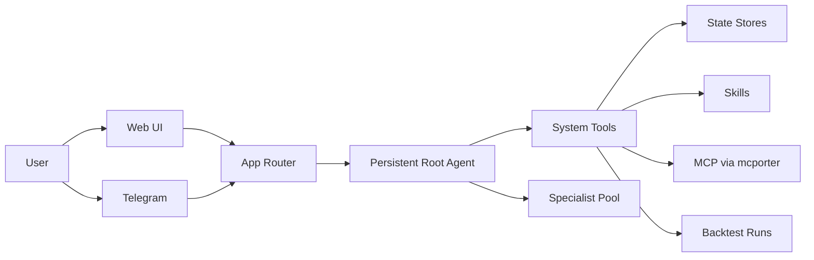

<p align="center">
  
</p>

<h1 align="center">StockClaw</h1>

<p align="center">
  一个为股票研究、模拟交易、历史回测与 Telegram 投递深度优化的多智能体系统。
</p>

<p align="center">
  
  
  
  
  
</p>

<p align="center">
  <a href="README.md">
    
  </a>
</p>

<p align="center">
  <a href="#快速开始">快速开始</a> ·
  <a href="#它能做什么">它能做什么</a> ·
  <a href="#架构">架构</a> ·
  <a href="#telegram">Telegram</a> ·
  <a href="#历史回测">历史回测</a>
</p>

> [!IMPORTANT]
> StockClaw 围绕一个持久化 root agent 构建。root 持有整个对话，会自行决定何时使用工具，只有在 specialist 确实能增加信号时才会 spawn。

## 它能做什么

<table>
  <tr>
    <td width="33%">
      <strong>深度股票研究</strong><br>
      一个持久化 root 协调多个专业分析师，从估值、技术面、情绪到风险多个维度协同分析。
    </td>
    <td width="33%">
      <strong>模拟交易</strong><br>
      结构化的模拟组合真值、明确的执行边界，以及完整可审计的状态变更。
    </td>
    <td width="33%">
      <strong>历史回测</strong><br>
      冻结数据集、隔离的逐日会话、严格的 `T-1` 约束，以及 agent 化的上下文补充流程。
    </td>
  </tr>
</table>

## 产品哲学

- StockClaw 首先是为股票分析优化的，不是普通的 LLM 聊天机器人套壳。
- root agent 对最终结论负责，只在 specialist 确实能增加有效信息时才按需调用。
- 系统不会把供应商特定的市场数据结构硬编码进业务工作流。
- 外部数据访问尽量通过社区 MCP 服务器和 skills 接入，这样无需重写核心交易或回测逻辑也能演进。
- 交易、配置修改、durable memory 写入等高风险动作都必须经过显式工具和可审计的状态流转。

## Specialist 池

StockClaw 内置了一组针对股票分析调优的 specialist：

- 价值分析师
- 技术分析师
- 新闻与情绪分析师
- 风险经理
- 组合代理
- 交易执行代理
- 系统运维代理

root agent 可以访问整组 specialist，只挑当前任务真正需要的角色，并负责综合最终答案。

## 数据与扩展模型

StockClaw 的设计目标之一，就是避免把某一家数据提供商硬焊进核心系统。

- 市场数据、研究数据和外部集成都预期通过社区 MCP 服务器和 skills 提供。
- 你可以先使用仓库内置的 skills。
- 当 StockClaw 跑起来后，你既可以让它帮助安装新的 skill 或 MCP 路径，也可以自己手动添加。
- 正常使用时，更推荐让 StockClaw 自己安装 MCP 和 skills，而不是手改仓库配置文件。
- 目的是让核心系统保持稳定，而把数据接入能力留在边缘持续演进。

## 示例场景

### 1. 回测你已经建好的组合

假设你已经配置好了一个组合，但你不知道过去几个交易日它的表现会如何，也不想手动收集数据、逐笔分析整个过程。

这正是 StockClaw 适合接管的工作流。你只需要说：

```text
帮我回测这个组合 7 天。
```

或者：

```text
回测我当前组合最近 7 个交易日的表现。
```

StockClaw 可以准备历史窗口、运行回测流程，并返回交易、回撤和收益表现总结。

> [!CAUTION]
> 除非你确实需要长周期回测，否则尽量把回测窗口控制得短一些。更长的日期范围会显著增加 token budget 和 tool budget 消耗，系统完成所需时间也会更长。

### 2. 找值得研究的股票

如果你不是要验证现有组合，而是想获得新的投资想法，可以让 StockClaw 搜索具有投资价值的标的并建立 shortlist。例如：

```text
帮我找几只具有较强投资潜力的美股，做一个观察名单。
```

或者：

```text
找几只价值、技术面和情绪面都比较协调的股票。
```

在这条流程里，root agent 可以先搜索、聚合数据，再按需调用 specialist，把大范围候选收缩成值得继续研究的标的。

### 3. 对单只股票做深度分析

如果你已经有明确的 ticker，StockClaw 可以继续向下钻，而不是只给一个泛泛总结。例如：

```text
帮我深度分析一下 MSFT。
```

或者：

```text
分析一下 NVDA 现在是否还有投资价值。
```

这类场景最能体现多智能体结构的价值：root 会把估值、技术结构、情绪和风险几条分析线合成为一个最终结论，而不是把碎片推理扔给你自己拼接。

## 为什么这样设计

- 一个持久化 root 能让普通对话的连续性保持稳定。
- specialists 是临时、隔离的，所以可以委派分析而不污染主会话。
- 高风险操作通过工具和状态存储完成，而不是靠自由文本执行。
- 回测能保持可复现，因为执行依赖冻结状态和受 `T-1` 约束的上下文读取。
- Telegram、重启处理、runtime reload、cron 自动化这些能力都收敛在适配器和服务层，而不会泄漏进组合逻辑。

## 快速开始

```bash
git clone https://github.com/24mlight/StockClaw.git
cd StockClaw
npm install
npm start
```

首次启动时，应用会引导你完成本地初始化：

- 单一本地 LLM 配置文件 `config/llm.local.toml`
- 可选的 Telegram 集成

如果本地 MCP 配置文件不存在，应用会在后台自动创建一个空文件。安装向导不会带你逐项填写 MCP server 凭证。

对于 LLM 配置，你可以任选一种方式：

- 让启动向导创建 `config/llm.local.toml`
- 自己基于 `config/llm.local.example.toml` 创建 `config/llm.local.toml`

LLM 配置采用单一 OpenAI-compatible endpoint 的形式，真正必填的只有：

- `model`
- `baseUrl`
- `apiKey`

超时、上下文窗口和 compaction threshold 都会使用系统默认值，除非你手动加入覆盖项。

Telegram 是可选的：

- 选 `no`：只使用 Web UI
- 选 `yes`：启用 Telegram

如果启用了 Telegram，初始化流程是：

1. 粘贴 bot token
2. 在 Telegram 里给你的 bot 发任意一条消息
3. 从 Telegram 里复制 pairing code
4. 把这段 pairing code 粘贴回本地终端
5. 如果想稍后再配对，可以输入 `skip`

所有生成的配置和运行时状态都保存在本地，并已被 git ignore。

如果你更喜欢手动管理，也可以自己创建这些本地文件。

默认地址：

```text
http://127.0.0.1:8000
```

## 启动时会加载什么

在 runtime 启动时，StockClaw 会加载：

- 本地 LLM 配置
- 本地 MCP 配置
- 已安装的 skills
- prompts
- 本地 memory 文件，包括 persona、用户偏好、工具使用习惯和投资原则
- 持久化的运行状态，例如 sessions、portfolio state、cron jobs 和 backtest artifacts

对 `config`、`skills` 和 `prompts` 的变更支持 watcher 驱动的 reload。

## 架构



应用层本质上只负责最外层路由。真正长期持有对话的是背后的持久化 root PI session。

## 核心流程

| 流程 | 行为 |
| --- | --- |
| 聊天 | root 处理当前 turn；简单任务直接用工具，只有必要时才 spawn specialists |
| Specialist 工作 | `sessions_spawn` 创建隔离的临时 session，并带上 profile 专属 prompt 和 tool policy |
| 模拟交易执行 | 先解析实时价格，再验证后更新结构化模拟交易状态 |
| 回测 | job 会先准备冻结数据集，再运行隔离的逐日会话，最终把结果推回原始 session |
| Telegram | 配对、reaction、媒体输入、文件投递和聊天传输都收敛在 Telegram adapter 内 |

## 历史回测

root agent 目前可以对这些对象发起回测：

- 单个资产
- 显式组合
- 当前模拟组合

当前的回测模型是：

- 外层工具提交异步 job，并立即返回回执
- prepare 阶段在运行时发现可用的历史数据路径
- 交易日历会在执行开始前先确定
- 每个交易日都运行在隔离的决策 session 中
- day session 可以请求更多历史 context，但只能通过受限的 backtest tools
- 最终结果完成后会被推送回发起该回测的原始 session

## Telegram

Telegram 是扩展入口，不是主要交互界面。

当前支持的能力包括：

- 本地 pairing 审批
- slash commands 用于查看状态和组合
- reactions
- 文件发送
- 异步回测结果投递
- 文本与非文本消息输入，例如图片和常见媒体附件

当前对非文本输入的处理会结合附件元数据：

- 文本和 caption 会被保留
- 纯媒体消息会被标准化成可用请求
- 附件摘要会进入 root 上下文

## 上下文与压缩

- 每个完成的 turn 后都会记录真实的 provider usage，并在 `/status` 中显示
- 上下文大小和 compaction threshold 来自本地 LLM 配置
- Compaction 是 PI session 本身的压缩步骤
- Flush 指的是 compaction 之前，对哪些 durable memory 需要落盘所做的决策
- Cron jobs 在独立 session 中运行，这样聊天 session 不会被撑大

## API

<details>
<summary>HTTP endpoints</summary>

- `GET /`
- `GET /health`
- `GET /api/runtime`
- `POST /api/runtime/reload`
- `POST /api/sessions`
- `GET /api/sessions/:id`
- `GET /api/sessions/:id/spawns`
- `POST /api/sessions/:id/messages`
- `GET /api/sessions/:id/status`
- `GET /api/portfolio`
- `PUT /api/portfolio`
- `POST /api/trades/execute`
- `GET /api/config`
- `PATCH /api/config`
- `POST /api/ops/install`

</details>

## 本地状态

<details>
<summary>被忽略的本地文件和运行状态</summary>

仓库会忽略这些本地工作状态：

- 本地配置
- 组合和 session 状态
- 回测产物
- 运行日志
- 本地 memory 文件

这些都是仅保存在本机的运行时文件，不属于仓库内容。

</details>

## 许可证

StockClaw 采用 MIT License，详见 [LICENSE](LICENSE)。
